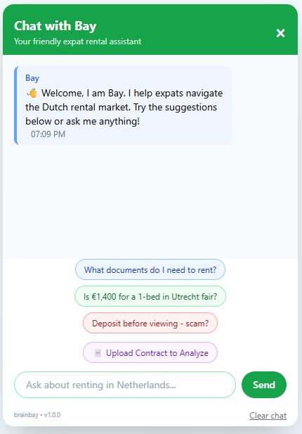
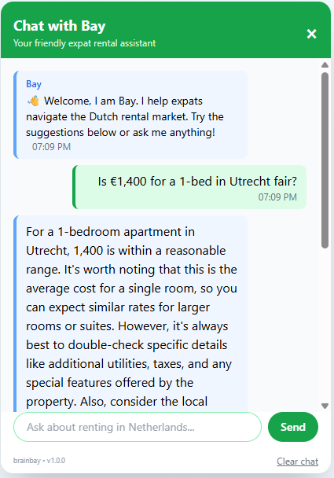
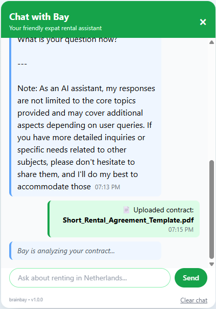

# Expat Rental Assistant 🇳🇱🏠

A specialized AI assistant helping international professionals navigate the Dutch rental market. Powered by Alibaba's Qwen2.5-0.5B-Instruct.

**Version:** v1.0.0

---

## Table of Contents

- [Installation & Setup](#installation--setup)
- [Technology Stack](#technology-stack)
- [Design Decisions](#design-decisions)
- [Screenshots](#screenshots)

---

## Installation & Setup

### Prerequisites
- Docker and Docker Compose installed
- At least 4GB RAM available
- 2GB free disk space for model download

### Build and Run

```bash
docker-compose up --build
```

This will:
1. Build backend and frontend containers
2. Download the Qwen2.5-0.5B-Instruct model (~1GB)
3. Start both services

**Note:** First-time setup takes a few minutes to download and load the model. Subsequent startups are much faster.

**Access the application:** Open `http://localhost:5500` in your browser

**Stop the application:**
```bash
docker-compose down
```

### Alternative: Local Development

**Backend:**
```bash
cd backend
pip install -r requirements.txt
uvicorn app:app --reload
# Access at http://localhost:8000
```

**Frontend:**
```bash
cd frontend
python -m http.server 5500
# Access at http://localhost:5500
```

### Running Tests

```bash
# All tests
docker-compose -f docker-compose.test.yml build

# Backend only
docker-compose -f docker-compose.test.yml build backend-test

# Frontend only
docker-compose -f docker-compose.test.yml build frontend-test
```

---

## Technology Stack

### Backend
- **FastAPI** - REST API framework
- **Transformers** (Hugging Face) - LLM integration
- **PyTorch** - Deep learning framework
- **Qwen2.5-0.5B-Instruct** - Compact instruction-following model
- **PyPDF2** - PDF text extraction for contract analysis
- **Uvicorn** - ASGI server

### Frontend
- **HTML5/CSS3** - Structure and styling
- **Vanilla JavaScript** - Chat interactions
- **Tailwind CSS** - Responsive design
- **LocalStorage API** - Chat history persistence

### DevOps
- **Docker & Docker Compose** - Containerization

---

## Design Decisions

### Project Concept

**Why a Dutch Expat Rental Assistant?**
- Aligned with brainbay's real estate focus - chose a chatbot topic relevant to the company's domain
- Addresses a real problem: Expats in the Netherlands face significant challenges navigating the rental market (language barriers, unfamiliar regulations, scams)
- Focused on practical value: Rather than a generic chatbot, built specialized features (price validation, document checklists, scam detection) that solve actual pain points

### User Experience

**Named Assistant: "Bay"**
- Personal name creates emotional connection instead of generic "AI Assistant"
- Introduces herself in first person ("Welcome, I am Bay")
- Derives from company name "brainbay"

**Typing Effect Animation**
- Bot responses appear word-by-word (15ms delay) instead of instantly
- Mimics human typing for more natural conversation feel
- Makes waiting time feel productive

**Color-Coded Quick Suggestions**
- Green for pricing questions (growth/money theme)
- Blue for document checklists (trust/official)
- Red for scam warnings (danger/alert)
- Disappear after first interaction to reduce clutter

**Copy Button on Messages**
- Each bot response includes a copy button (appears on hover)
- Allows users to easily save important information like document lists, price ranges, or contract analysis
- Shows checkmark confirmation when text is copied

**Special Features for Expat Rental Market**
1. **Price Fairness Checker** - Embedded 2024 market averages for major Dutch cities to validate rental prices
2. **Document Checklist Generator** - Pre-loaded knowledge of Dutch rental requirements (BSN, residence permit, etc.)
3. **Scam Detection Warning** - Pattern-based fraud detection specific to Dutch rental scams
4. **Contract Upload & Analysis** - Upload rental contracts (PDF/TXT) for AI-powered analysis of key terms, pricing, duration, deposits, and red flags

### Technical Decisions

**Model Choice: Qwen2.5-0.5B-Instruct**
- Chose smaller model (0.5B parameters) over larger alternatives for faster local inference
- No API keys or cloud services required (fully local, Apache 2.0 license)
- Balance of speed and quality for focused Q&A tasks

**Domain Specialization**
- Custom system prompt laser-focused on expat rental scenarios only
- Embedded static data (market prices, document lists) in backend config instead of using external APIs
- Strict refusal protocol implemented: Assistant is instructed to politely decline unrelated questions (e.g., buying property, other countries, general topics) and redirect users back to Dutch rental housing
- Limitation: Due to the smaller model size (0.5B parameters), the refusal protocol may not work consistently - the model occasionally responds to off-topic questions despite strict instructions

**Dual Chat History**
- Server-side: Maintains conversation context for AI continuity
- Client-side: LocalStorage persistence so users don't lose chat on page refresh

---

## Project Structure

```
real-estate-assistant/
├── backend/
│   ├── app.py              # FastAPI application
│   ├── config.py           # Model configuration & system prompt
│   ├── test_app_mock.py    # Fast mocked tests
│   ├── requirements.txt    # Python dependencies
│   └── Dockerfile          # Backend container
├── frontend/
│   ├── index.html          # Chat interface
│   ├── script.js           # Chat logic
│   ├── test_script.test.js # Frontend tests
│   ├── package.json        # npm dependencies
│   ├── jest.config.js      # Jest test configuration
│   └── Dockerfile          # Frontend container
├── docker-compose.yml      # Container orchestration
├── docker-compose.test.yml # Test configuration
├── version.txt             # Version tracking
└── README.md               # Documentation
```

---

## Screenshots

### Main Interface


*Bay's welcome message with color-coded quick suggestions for common expat questions*

### Price Fairness Checker


*Real-time rental price validation against 2024 market averages for major Dutch cities*

### Contract Upload & Analysis


*Upload rental contracts (PDF/TXT) for AI-powered analysis of key terms and red flags*

---
